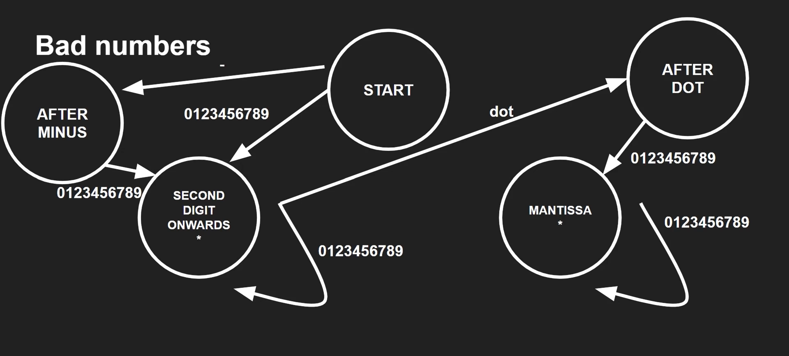

## Finite State Machine - Valid Numbers

Check if input is a valid float using a finite state machine in C and Python.

### Example Inputs

Valid
- 3.14
-  -22.0
-  -7

Invalid
- 71 .
- --22.0
- 3.12k345

## State Machine Diagram

Valid numbers can only be found when the final state is either SECOND DIGIT ONWARDS or MANTISSA (mantissa is the digits after the decimal point).